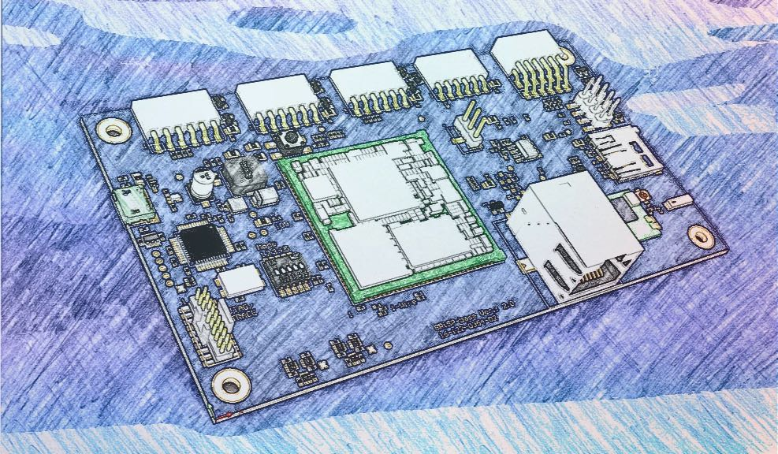

# GRiSP 2 Support

This is the base Nerves System configuration for the [GRiSP 2](http://grisp.org/). Since The GRiSP 2 isn't
available yet, we're running it on a [PHYTEC
phyBOARD-Segin](https://phytec.com/product/phyboard-imx6ul-segin/).

| Feature              | Description                     |
| -------------------- | ------------------------------- |
| CPU                  | NSP iMX6UL, ARM ARM Cortex-A7 @ 696 MHz |
| Memory               | 128 MB DRAM                     |
| Storage              | 4 GB eMMC Flash and MicroSD     |
| Linux kernel         | 4.14 w/ Phytec patches          |
| IEx terminal         | ttyS0                           |
| GPIO, I2C, SPI       | Yes - [Elixir Circuits](https://github.com/elixir-circuits) |
| ADC                  | -                               |
| PWM                  | -                               |
| UART                 | ttyS0-ttyS4                     |
| Camera               | None                            |
| Ethernet             | Yes                             |
| WiFi                 | Will be enabled when GRiSP 2 is available  |
| HW Watchdog          | iMX6 watchdog enabled on boot. Be sure to enable `heart` in your vm.args or the device will reboot |

## Using

The most common way of using this Nerves System is create a project with `mix
nerves.new` and to export `MIX_TARGET=grisp2`. See the [Getting started
guide](https://hexdocs.pm/nerves/getting-started.html#creating-a-new-nerves-app)
for more information.

If you need custom modifications to this system for your device, clone this
repository and update as described in [Making custom
systems](https://hexdocs.pm/nerves/systems.html#customizing-your-own-nerves-system)

If you're new to Nerves, check out the
[nerves_init_gadget](https://github.com/nerves-project/nerves_init_gadget)
project for creating a starter project. It will get you started with the basics
like bringing up networking, initializing the writable application data
partition, and enabling ssh-based firmware updates.  It's easiest to begin by
using the wired Ethernet interface 'eth0' and DHCP.

## Preparing the PHYTEC phyBOARD-Segin

The phyBOARD-Segin defaults to booting off an integrated NAND Flash. The
GRiSP 2 will have an eMMC Flash instead, so support for NAND has been disabled.
In the interim, this system only supports booting off the MicroSD card slot. To
enable this, place a jumper across J1.

## Console access

The console is configured to output to `ttyS0` by default.

TODO: Change to a UART that's doesn't require the debug daughter board.

## Provisioning devices

TODO: The GRiSP 2 includes an ATECC608A so provisioning the board for use with
NervesHub can be done without setting U-Boot environment variables.

## Linux and U-Boot versions

*TBD*

We're currently using PHYTEC's Linux kernel fork from
[git.phytec.de/linux-mainline](git://git.phytec.de/linux-mainline).

## Supported USB WiFi devices

*TBD*

The base image includes drivers and firmware for the TI WiLink8 (`wl18xx`),
Ralink RT53xx (`rt2800usb` driver) and RealTek RTL8712U (`r8712u` driver)
devices. All WiFi drivers are compiled as modules. Some drivers can be loaded
automatically. If you have a Beaglebone Green or Beaglebone Black with built-in
WiFi, see the next section.

We are still working out which subset of all possible WiFi dongles to support in
our images. At some point, we may have the option to support all dongles and
selectively install modules at packaging time, but until then, these drivers and
their associated firmware blobs add significantly to Nerves release images.

If you are unsure what driver your WiFi dongle requires, run Raspbian and
configure WiFi for your device. At a shell prompt, run `lsmod` to see which
drivers are loaded.  Running `dmesg` may also give a clue. When using `dmesg`,
reinsert the USB dongle to generate new log messages if you don't see them.

## Installation

If you're new to Nerves, check out the
[nerves_init_gadget](https://github.com/fhunleth/nerves_init_gadget) project for
creating a starter project for the Beaglebone boards. The instructions are
basically the same for the Raspberry Pi Zero or Zero W except you should `export
MIX_TARGET=grisp2` so that the appropriate `mix` targets get run. It will get you
started with the basics like bringing up the virtual Ethernet interface,
initializing the application partition, and enabling ssh-based firmware updates.

